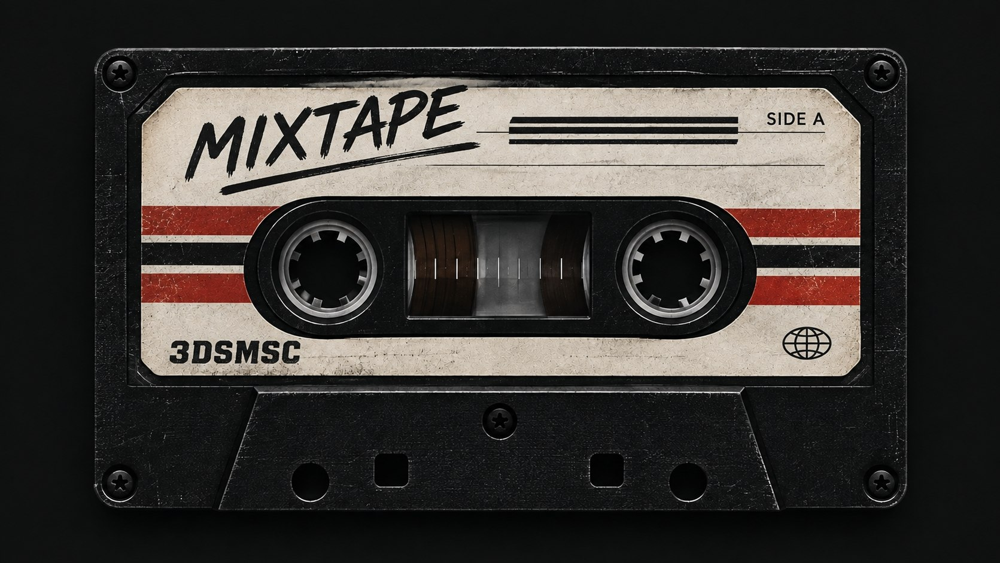

# 3DSMSC

3DSMSC is a lightweight Nintendo 3DS homebrew music player for offline SD-card libraries. Its top
screen shows an animated cassette; the bottom screen is a touch UI for browsing, searching, and
controlling playback.



## App metadata

- Name: `3dsmsc`
- Version: `0.5.2`
- Maintainer: `@mcrx0`
- Description: `A lightweight offline music player for the Nintendo 3DS`

## Features

**Playback**

- MP3 (minimp3), FLAC (dr_flac), and AAC / M4A / MP4 audio (FAAD2 and minimp4).
- Pause, previous/next, volume, and seek buttons with a configurable step (5, 10, 15, or 25 s).
  Seeking runs on the audio thread, so the UI never waits for it.
- Repeat (off, all, one) and shuffle (every track once per pass, then reshuffled).
- A ten-band equalizer (31 Hz to 16 kHz, ±12 dB) with presets and a touch bar editor.
- Background playback while the lid is closed, a headphone icon while headphones are plugged in, a battery indicator (icon, percentage, or off), and a small cover image beside the title (a `cover.jpg`/`cover.png` or `folder.jpg`/`folder.png` in the album folder, or the picture embedded in the MP3, FLAC or M4A file; it can be switched off under **Settings > UI**).

**Library**

- Scanning is always an explicit action, can be cancelled, and shows progress.
- Pick any folders on the SD card to scan, or use the default `sdmc:/3dsmsc/music/`.
- The scan result is saved and restored at start-up, so Browse and Search work straight away.
- Tags: ID3v2.3/2.4, FLAC Vorbis comments, and MP4 atoms (title, artist, album, track and disc
  numbers, Latin-1/UTF-16/UTF-8 text); MP3 length from the Xing/Info header or the bitrate.
- Artist → Album → Track browsing, full-text search, and a saved queue.

**Interface**

- Dark and light themes, a cassette view whose reels and tape move with playback, and a time
  display that counts down the remaining time.

## Installing and running

1. Copy `3dsmsc.3dsx` to `sdmc:/3ds/` and launch it from the Homebrew Launcher.
2. Put music in `sdmc:/3dsmsc/music/` (the app creates the folder on first run), or choose other
   folders in **Settings > Music folders**.
3. Open **Settings > Full scan again** once. Browse and Search then work after every restart.

**Audio needs the DSP firmware.** libctru's audio engine requires `sdmc:/3ds/dspfirm.cdc`. Without
it the status line says `No DSP firmware: add sdmc:/3ds/dspfirm.cdc` and nothing can play. Dump it
from your own console with [DSP1](https://github.com/zoogie/DSP1/releases). Citra needs the same
file in its emulated SD card (`sdmc/3ds/dspfirm.cdc`).

## Controls

| Where | Control | Action |
| --- | --- | --- |
| Home | Play/pause button, **A** | Play or pause |
| Home | Previous / next buttons, **Y** / **X** | Previous / next track |
| Home | Seek buttons, **D-pad ←/→** | Seek back / forward by the seek step |
| Anywhere | **L** / **R** | Volume down / up |
| Anywhere | **START** | Exit |
| Lists | **D-pad ↑/↓**, tap a row | Move / select |
| Lists | **D-pad ←/→** | Page up / down |
| Lists | **A**, tap the selected row | Open or activate |
| Lists | **B**, tap the title bar | Back |
| Search | **A** / **X** | Type a search / edit it |
| Folders | **X**, tap the tick box | Tick a folder to scan |
| Queue | Button row | Repeat (left half) and shuffle (right half) |
| Equalizer | Drag a bar, **D-pad**, **A**, **X**, **Y** | Set gain, pick band, on/off, next preset, reset |

The bottom-screen home view has a library card (tap it to choose folders), the transport row, and
four tiles: **Search**, **Browse**, **Queue**, and **Settings**. Settings is grouped into
**Library**, **Sound**, **UI**, and **Misc**, which holds **Button mapping** (the table above, on
the console) and **About this** (the version, credits, and third-party libraries).

## Files on the SD card

| Path | Purpose |
| --- | --- |
| `sdmc:/3dsmsc/config.toml` | Settings, written by the app (see `config/config.toml.example`) |
| `sdmc:/3dsmsc/folders.txt` | The folders chosen for scanning, one per line |
| `sdmc:/3dsmsc/library.cache` | The last scan result, so a restart does not lose the library |
| `sdmc:/3dsmsc/queue.txt` | The saved queue and its position |
| `sdmc:/3dsmsc/boot.log` | Start-up steps and slow frames, for diagnosing problems |
| `sdmc:/3dsmsc/music/` | The default music folder |

## Known limitations

- Cover art is found during a scan (`cover.png`, `cover.jpg`, `folder.*`) and saved, but not drawn.
- Compilations split into one album per artist, because album-artist tags are not read.
- Track numbers are not read from MP4/M4A files.
- The `[controls]` keys in `config.toml` are read and saved, but buttons are not remappable yet.
- The library cache can list files deleted after the scan; they are skipped when played.
- Each scanned folder is limited to 10,000 tracks.

## Building

Host build and tests (any Linux with CMake, Ninja, and a C++17 compiler):

```sh
cmake -S . -B build -G Ninja -DBUILD_TESTING=ON
cmake --build build
ctest --test-dir build --output-on-failure
```

3DS build, with devkitPro (devkitARM, libctru, citro2d, `3dsxtool`, `tex3ds`) installed:

```sh
export DEVKITPRO=/opt/devkitpro
export DEVKITARM="$DEVKITPRO/devkitARM"
cmake -S . -B build/3ds -G Ninja -DBUILD_3DS=ON -DBUILD_TESTING=OFF \
  -DCMAKE_BUILD_TYPE=Release -DCMAKE_TOOLCHAIN_FILE=cmake/3DS.cmake
cmake --build build/3ds
```

This produces `build/3ds/3dsmsc.3dsx` and copies it to `dist/3dsmsc.3dsx`. Building the icon sheet
needs Python 3 with `librsvg2` and `libcairo2` installed. With no devkitPro on the host, the
official `devkitpro/devkitarm` container works too; see [docs/building.md](docs/building.md).

After changing code that runs on the main thread, run `scripts/check-stack-usage.sh`: the 3DS main
thread has only a 32 KB stack, and an overflow there freezes the app on the console while a PC
never notices.

## Repository layout

| Path | Contents |
| --- | --- |
| `include/3dsmsc/`, `src/` | Portable modules: `audio`, `config`, `library`, `playback`, `queue`, `ui`, `util` |
| `src/3ds/` | The platform layer: entry point, the `App` class, citro2d renderer, NDSP audio player |
| `tests/` | Host unit tests and audio fixtures |
| `assets/` | The app icon, the UI reference image, and the editable SVG icon set (`assets/icons/`) |
| `scripts/` | Toolchain setup, icon generation, the quality checks, and the stack-usage check |
| `tools/host_harness/` | Runs the console code on a PC against fake libctru headers, for scripted and fuzzed sessions |
| `third_party/` | minimp3, minimp4, dr_flac, and FAAD2, with their licenses |
| `docs/` | Architecture, building, testing, third-party licenses, and decision records |

## Documentation

- [docs/architecture.md](docs/architecture.md): modules, threads, data flow, and platform limits.
- [docs/building.md](docs/building.md): build, container build, stack check, and CI.
- [docs/testing.md](docs/testing.md): host tests, the host harness, and the hardware checklist.
- [docs/container-workflow.md](docs/container-workflow.md): building, checking, and replaying CI in the devkitPro container.
- [docs/coding-standards.md](docs/coding-standards.md): naming, structure, and the checks that enforce them.
- [docs/adr/](docs/adr/): the decisions behind the design.
- [CONTEXT.md](CONTEXT.md): the project's vocabulary.
- [config/config.toml.example](config/config.toml.example): every runtime setting.

## License

3DSMSC is free software under the [GNU General Public License v3.0 or later](LICENSE). It bundles
FAAD2 (GPL-2.0-or-later), minimp3 and minimp4 (CC0), dr_flac (Unlicense / MIT-0), and stb_image (MIT or public domain), and the 3DS
build links libctru, citro2d, and citro3d (zlib). The full list, with the reason for the choice, is
in [docs/third-party-licenses.md](docs/third-party-licenses.md).
